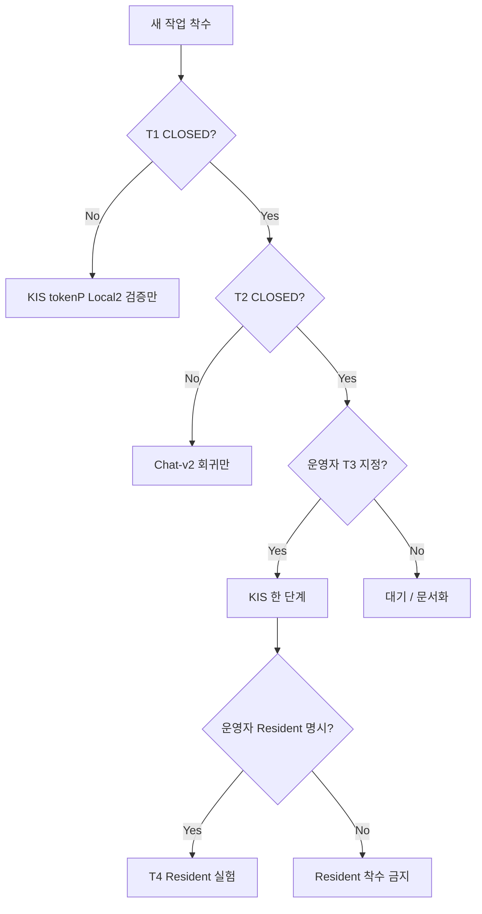

# Simon 마스터 계획표 (강제 준수) — 2026-05-20

> **성격**: 이 문서는 “참고”가 아니라 **진도·범위·PASS의 단일 기준(SSOT for work)** 이다.  
> 신규 Cursor / Local1 / Local2 / Cloud Agent는 **아래 순서를 바꾸지 않는다.**  
> 예외는 **운영자(감독)가 채팅으로 명시 승인**한 경우만.

**관련 문서**
- 기술 핸드오프: `SIMON_HANDOFF_20260520.md`
- 운영자·Simon·Qwen 관계: `SIMON_QWEN_OPERATOR_RELATION_20260520.md`
- Resident 상세(3단계 이후만): `resident_chatv2_delivery_20260518.md`

---

## 0. 절대 규칙 (위반 = 작업 무효)

| # | 규칙 | 위반 시 |
|---|------|---------|
| R1 | **운영자 PASS 없이 “완료” 선언 금지** | 보고서 무효 |
| R2 | **Local1 PASS ≠ 완료**. Local2 독립 검증 필수 | 머지·다음 단계 금지 |
| R3 | **Qwen/Simon이 주문·실연동 결정 금지**. 기본 `broker_submit=false` | 즉시 롤백 |
| R4 | **`KIS_USE_REAL_HTTP=0`, `KIS_ALLOW_TOKEN_REQUEST=0` 없이 실 HTTP·토큰 금지** | 즉시 중단 |
| R5 | **GPU·대량 학습은 운영자 ON 전까지 금지** | 작업 취소 |
| R6 | **Resident를 “진도”의 1순위로 두지 않는다** (§2 스프린트 표 참고) | 방향 오류 |
| R7 | PASS는 **로그 한 줄이 아니라 운영자 Chat-v2 재현** | CLOSED 거부 |

---

## 1. 역할 (혼동 금지)

| 역할 | 책임 | 금지 |
|------|------|------|
| **운영자** | 우선순위 승인, PASS/FAIL, 게이트 ON, 주문 승인 | Cursor 말만 믿고 서명 |
| **Simon (런타임)** | SSOT·NLU·게이트·FACT_BOX | 환각·무단 주문 |
| **Qwen (런타임)** | FACT_BOX 설명 | 사실 창작·API 호출 |
| **Local1** | 구현·단위 테스트 | 스스로 최종 PASS |
| **Local2** | 독립 재현·반박·보고서 | Local1과 동일 PC·동일 뇌로만 확인 |
| **Cloud Cursor** | 계획·기준·핸드오프 (본 문서) | Resident부터 시키기 |

---

## 2. 현재 스프린트 (잠금 — 운영자 해제 전 변경 불가)

**스프린트 ID**: `SPRINT-20260520-A`  
**목표**: *실거래 없이* KIS tokenP 스텁 검증 완료 + Chat-v2 일상 조회 회귀 방지  
**명시적 비목표**: Resident E2E 완성, 실 KIS 연동, Qwen/NLU 본격 학습

### 2.1 작업 순서 (이 순서만 유효)

| 순위 | 작업 ID | 내용 | 담당 | Gate (다음으로 가려면) |
|:----:|---------|------|------|-------------------------|
| **1** | `T1-KIS-TOKENP-VERIFY` | KIS tokenP HTTP **contract stub** Local2 검증 | Local2 | §3.1 전항목 PASS |
| **2** | `T2-CHAT-REGRESSION` | Chat-v2 회귀: 현재가·예수금·명확화 | Local1 수정 / Local2 확인 | §3.2 전항목 PASS |
| **3** | `T3-KIS-NEXT-STEP` | 스텁 PASS 후 KIS **한 단계**만 (문서·게이트·목록) | Local1 + 운영자 | §3.3 + 운영자 승인 |
| **4** | `T4-RESIDENT-EXPERIMENTAL` | Resident E2E (사용자 PC, chat send OFF) | Local1 / **운영자 PC** | §3.4 — **스프린트 1·2 CLOSED 후만** |
| — | `FORBIDDEN` | Resident 신규 기능·device 튜닝·E2E를 1·2보다 먼저 | — | **착수 금지** |

### 2.2 “진도 나가라”의 정의 (이 스프린트)

```
진도 = T1 완료 → T2 완료 → (운영자 승인) T3 → 그 다음에만 T4
진도 ≠ Resident 마이크/VAD/STT 작업
```

---

## 3. Gate — PASS 체크리스트 (하나라도 FAIL이면 CLOSED 불가)

### 3.1 `T1-KIS-TOKENP-VERIFY` (Local2)

| # | 항목 | PASS 조건 |
|---|------|-----------|
| 1 | 테스트 | `pytest tests/test_kis_env_status_gates.py` (및 관련) **독립 실행** 성공 |
| 2 | 실 HTTP | `KIS_USE_REAL_HTTP=0` 상태에서 **외부 KIS 호출 0건** (로그·패킷·tcp 증거) |
| 3 | 토큰 요청 | `KIS_ALLOW_TOKEN_REQUEST=0` 상태에서 tokenP **실요청 0건** |
| 4 | 비밀 | 로그·`/api/status`·보고서에 `appkey`/`appsecret`/`access_token` **원문 없음** |
| 5 | fixture | `tokenP_sample_ok` / `missing_field` 동작이 status·audit와 **일치** |
| 6 | 산출물 | `data/reports/kis_tokenP_local2_verify_YYYYMMDD.md` (Local1 보고서와 **별도**) |

**CLOSED 서명**: Local2 보고서 + 운영자 “T1 OK”

---

### 3.2 `T2-CHAT-REGRESSION` (운영자 재현 필수)

| # | 시나리오 | 입력 | PASS 조건 |
|---|----------|------|-----------|
| 1 | 현재가 | `삼성전자 현재가 알려줘` | **≤3초**, intent 가격 조회, `broker_submit=false`, `executed=false` |
| 2 | 예수금 버튼 | UI 「예수금」 | **≤1초** “KIS 미연동/미확인” (60초 블로킹 **FAIL**) |
| 3 | 종목 없음 | `현재가 알려줘` | clarification (종목 검색 실패 **아님**) |
| 4 | wake | `사이먼 삼성전자 현재가 알려줘` | 전송/해석: `삼성전자 현재가 알려줘` 수준 |
| 5 | UI | Chat-v2 | 개발자 메타 **기본 숨김**, 답변 가독 가능 |
| 6 | Qwen | FACT_BOX 대비 | **없는 숫자·종목 창작 없음** (있으면 Qwen FAIL, Simon SSOT는 유지) |

**증거**: `chat_v2_messages.jsonl`, `chat_latency.jsonl`, 스크린 또는 운영자 한 줄 확인  
**CLOSED 서명**: 운영자 “T2 OK”

---

### 3.3 `T3-KIS-NEXT-STEP` (한 번에 한 칸만)

**전제**: T1 CLOSED.

| 허용 (예시, 운영자가 문서에서 지정한 1개만) | 금지 |
|---------------------------------------------|------|
| onboarding 체크리스트 갱신 | 실계좌 주문 API |
| read-only live **게이트 설계** 문서 | `KIS_USE_REAL_HTTP=1` 무단 |
| symbol master 파이프 **목 테스트** | tokenP 실발급 |
| status 필드 추가 (비밀 없이) | WS 41종목 실구독 |

**CLOSED**: 운영자가 “다음 한 단계”를 지정·승인한 항목 1개만 DONE.

---

### 3.4 `T4-RESIDENT-EXPERIMENTAL` (후순위 — 스프린트 후반만)

**전제**: T1 + T2 CLOSED. 운영자가 “이제 Resident”라고 **명시**한 경우만.

| # | 항목 | PASS 조건 |
|---|------|-----------|
| 0 | 기본 | `SIMON_RESIDENT_CHAT_SEND_ENABLED=0` **유지** (운영자 해제 전) |
| 1 | VAD | `vad_detected=true` 또는 재시도 후 transcript |
| 2 | 전송 | `resident_events.jsonl`: `transcript_sent` (send ON일 때만) |
| 3 | Chat | `source=resident` user+assistant (send ON일 때만) |
| 4 | TTS | `tts_spoken ok=true` (해당 시) |
| 5 | UI | `resident_default&tts=1` 일치 |

상세: `resident_chatv2_delivery_20260518.md`  
**주의**: §6 “최우선 UX” 표현은 **폐기**. Resident는 **T4**, 일상 운영 SSOT는 **Chat 타이핑**.

---

## 4. Phase 로드맵 (전체 — 스프린트 이후)

```
Phase 0 ──► Phase 1 ──► Phase 2 ──► Phase 3 ──► Phase 4 ──► Phase 5
 안전골격     Chat-v2      KIS SSOT     tokenP스텁    실KIS RO      학습
 (진행)       (회귀유지)   (목)         (T1)         (게이트)      (보류)
```

| Phase | 이름 | 산출 | 진입 조건 | 완료 조건 |
|-------|------|------|-----------|-----------|
| **0** | 실행·안전 골격 | Safety gate, 기본 HOLD | — | 모든 조회 `broker_submit=false` |
| **1** | Chat-v2 운영 가능 | NLU, UI, fast fallback | 0 | **T2 CLOSED** |
| **2** | KIS read-only SSOT | normalized models, mock | 1 | 목 테스트·rate limit 스켈레톤 |
| **3** | tokenP 계약 | http_client stub, audit | 2 | **T1 CLOSED** |
| **4** | 실 KIS read-only | live HTTP (게이트 ON) | 3 + **운영자 게이트** | 운영자 RO PASS |
| **5** | NLU/Qwen 학습 | Gold 데이터만 | 1·2 안정 + **운영자 GPU ON** | 별도 승인 |

**Phase 4·5 착수 금지 조건**: T1/T2 미완료, Resident를 1순위로 하는 동안.

---

## 5. 주간이 아닌 “상태” 마일스톤 (달력 추정 금지)

| 마일스톤 | 상태명 | 의미 |
|----------|--------|------|
| M0 | `UNSTABLE_CHAT` | Chat-v2 회귀 FAIL — **다른 모든 작업 중단** |
| M1 | `TOKENP_VERIFIED` | T1 CLOSED |
| M2 | `DAILY_OPS_OK` | T2 CLOSED — 운영자 일상 질의 가능 |
| M3 | `KIS_RO_READY` | T3 한 단계 + 운영자 게이트 문서 |
| M4 | `RESIDENT_EXPERIMENTAL` | T4 (선택) |
| M5 | `LEARNING_PIPELINE` | Phase 5 (운영자 GPU ON) |

**현재 공식 위치**: `M0` 또는 `M1` 직전 — **T1·T2가 스프린트 전부**.

---

## 6. 하지 말 것 (강제 금지 목록)

| 금지 | 이유 |
|------|------|
| Resident VAD/device/STT 대규모 수정을 T1/T2 전에 | 진도 착각·Chat 오염 |
| `resident_chatv2_delivery`만 보고 “최우선” 판단 | §2와 모순 |
| 실 KIS·실 tokenP | R4 |
| 7만 NLU 일괄 학습 | 오염·GPU R5 |
| Qwen에 SSOT 없이 답변 허용 | 환각 |
| “재시작하면 됩니다”로 PASS | R7 |
| Browser Resident Mode 재도입 | 운영자 폐기 결정 |
| 포트 18080·8080 혼용 방치 | 회귀·PID 혼란 |

---

## 7. 산출물 규격 (매 작업)

| 산출물 | 경로 | 작성자 |
|--------|------|--------|
| Local1 구현 보고 | `data/reports/*_local1_YYYYMMDD.md` | Local1 |
| Local2 검증 보고 | `data/reports/*_local2_verify_YYYYMMDD.md` | Local2 |
| 운영자 PASS | 채팅 한 줄 또는 보고서 서명란 | 운영자 |

보고서 **필수 필목**: git/build id, `server_pid`, port, 테스트 명령, raw 로그 **경로**(비밀 마스킹).

---

## 8. 의사결정 트리 (신규 Cursor용)



---

## 9. 운영자 ↔ Simon ↔ Qwen (이 계획에서의 위치)

| 계층 | 스프린트 역할 |
|------|----------------|
| **운영자** | T1/T2 **최종 CLOSED**, T3 게이트·T4 Resident 스위치 |
| **Simon** | T2 구현·T1 status·T3 SSOT |
| **Qwen** | T2에서 설명 품질만; **T1·T3에 끼어들지 않음** |

---

## 10. 신규 Cursor 첫 지시 (복붙 — 강제)

```
SIMON_MASTER_PLAN_20260520.md 를 SSOT로 따른다.

스프린트 SPRINT-20260520-A:
1) T1-KIS-TOKENP-VERIFY (Local2) — Resident 하지 마라
2) T2-CHAT-REGRESSION — 운영자 3초/1초 PASS
3) T1·T2 CLOSED 전 T4-RESIDENT 착수 금지

완료 선언은 운영자 PASS 후만. 실 HTTP·GPU·학습 금지.
```

---

## 11. 문서 충돌 시 우선순위

1. **본 문서** `SIMON_MASTER_PLAN_20260520.md` (작업 순서·Gate)  
2. `SIMON_HANDOFF_20260520.md` (기술 상세)  
3. `SIMON_QWEN_OPERATOR_RELATION_20260520.md` (관계·신뢰)  
4. `resident_chatv2_delivery_20260518.md` (**T4에서만** 적용)

`HANDOFF §6 “Resident 최우선 UX”` 문구는 **본 계획표에 의해 폐기**한다.

---

*작성: 2026-05-20 — 운영자 요청 “강한 계획표”*
