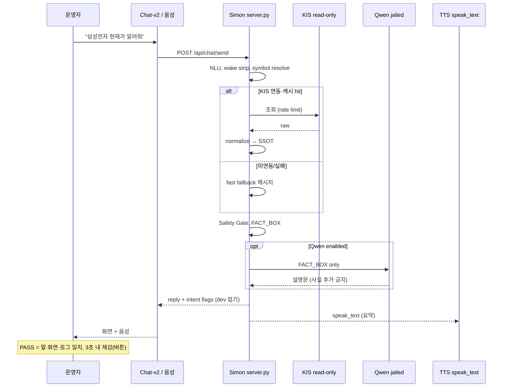

# Qwen + Simon ↔ 운영자(감독) 관계 정리 (2026-05-20)

> 신규 Cursor·Local1/2·운영자 본인이 **“누가 무엇을 결정하고, 무엇을 믿으며, 무엇을 절대 맡기지 않는지”**를 공유하기 위한 문서.  
> 기술 핸드오프: `SIMON_HANDOFF_20260520.md`

---

## 1. 한 장 요약

| 주체 | 비유 | 권한 | 하지 않는 것 |
|------|------|------|----------------|
| **운영자(나)** | 선장·최종 승인자 | 목표 설정, PASS/FAIL, 주문·실계좌·게이트 승인, 학습·GPU ON/OFF | 코드 직접 구현(보통 Local Cursor에 위임) |
| **Simon** | 항해사·엔진룸·단일 진실(SSOT) | NLU, 라우팅, KIS 조회·정규화, Safety Gate, 로그, `FACT_BOX` 조립 | “예쁜 말” 창작, LLM식 추측으로 주문 결정 |
| **Qwen** | 통역·브리핑 요원(감옥 LLM) | `FACT_BOX`를 사람 말로 설명·요약 | 사실 생성, 수치 계산·조작, 주문·KIS 직접 호출 |

**핵심 문장**:  
- **사실·숫자·실행 여부는 Simon이 정한다.**  
- **Qwen은 Simon이 준 사실을 말로 풀 뿐이다.**  
- **돈·주문·실연동·학습은 운영자가 열고 닫는다.**

---

## 2. 왜 세 층으로 나누는가

주식 보조에서 실패는 보통 세 가지다.

1. **잘못된 사실** (환각, 오래된 가격, 잘못된 종목)
2. **잘못된 실행** (의도 없는 주문, 승인 없는 매매)
3. **잘못된 신뢰** (말은 그럴듯한데 로그·UI와 불일치)

그래서:

- **Simon** = 계산·조회·규칙·게이트의 **단일 책임**
- **Qwen** = UX(자연어 설명)만 담당, **권한 최소화**
- **운영자** = 시스템이 자동으로 넘어가면 안 되는 경계의 **최종 인간**

“Qwen이 똑똑해지면 Simon 없이도 된다”는 방향은 **프로젝트 목표와 반대**이다.

---

## 3. 권한 계층 (누가 무엇을 ‘결정’하는가)

```
                    ┌─────────────────────┐
                    │   운영자 (최상위)    │
                    │  목표·승인·중단    │
                    └──────────┬──────────┘
                               │ 주문/실연동/학습만 승인
                    ┌──────────▼──────────┐
                    │       Simon          │
                    │  사실·라우팅·게이트  │
                    └──────────┬──────────┘
                               │ FACT_BOX만 전달
                    ┌──────────▼──────────┐
                    │       Qwen           │
                    │   설명·요약만       │
                    └─────────────────────┘
```

### 3.1 운영자만 할 수 있는 것 (위임 불가)

| 영역 | 운영자가 하는 일 | Simon/Qwen/Cursor가 대신하면 안 됨 |
|------|------------------|-------------------------------------|
| **주문·매매** | 최종 “한다/안 한다” | Qwen 설득, Simon intent만으로 체결 |
| **실계좌·KIS 게이트** | `KIS_USE_REAL_HTTP`, 토큰 발급 허용 등 환경 ON | Local Cursor가 임의로 실거래 연결 |
| **리스크 한도** | 일손실 한도, 전략 가동 여부 | LLM이 “괜찮아 보여요”로 판단 |
| **PASS/FAIL** | “느리다/안 된다/신뢰 못 한다” | 개발자가 로그만 보고 PASS 선언 |
| **학습·GPU** | 데이터 투입·학습 시작·중단 | 7만 건 일괄 학습, 밤샘 GPU |
| **제품 방향** | Resident 우선 vs KIS 우선 vs Chat 안정 | Cursor가 임의로 범위 확장 |

### 3.2 Simon이 할 수 있는 것 (운영자에게 보고)

- 사용자/음성/채팅 입력 → **intent·종목·라우트** 결정
- KIS(또는 목) → **정규화된 시세·잔고** (SSOT)
- 조회·설명 경로에서 **`executed=false`, `broker_submit=false`** 유지
- 주문 **준비(prepare)** 까지는 가능하나, **제출(submit)은 게이트+운영자** 없이 불가
- `FACT_BOX` 작성: Qwen·UI·TTS가 쓸 **검증된 필드만** 포함

### 3.3 Qwen이 할 수 있는 것 (감옥 안)

- `FACT_BOX`에 있는 문장을 **재서술·요약·톤 조정**
- “주문은 실행하지 않았습니다” 같은 **Simon이 이미 넣은 안전 문구**를 자연스럽게 전달
- 운영자가 읽기 쉬운 **짧은 답** (단, 숫자·종목명은 FACT_BOX와 불일치하면 FAIL)

### 3.4 Qwen이 절대 하면 안 되는 것

- FACT_BOX에 **없는** 가격·잔고·뉴스·전망 **창작**
- 종목코드·수량·가격을 **스스로 계산·수정**
- KIS API·주문 API **직접 호출**
- “지금 사세요/팔으세요”를 **운영자 승인 없이** 단정
- 비밀·토큰·계좌번호 **복원·추측**

---

## 4. 한 턴의 데이터 흐름 (운영자 시점)



**운영자가 확인할 것 (한 턴)**:

1. 화면 답이 **이해 가능한가** (개발자 메타가 기본 숨김인지)
2. 말(TTS)이 **너무 길거나 코드 읽기**가 아닌지
3. 개발자 상세에서 `broker_submit=false`, `executed=false` (조회 시)
4. 로그 한 줄이 UI와 **같은 intent·종목**인지

---

## 5. 운영자 ↔ Simon 관계 (상세)

### 5.1 Simon은 “직원”이 아니라 “시스템”

- **말투**: Chat-v2에서 Simon은 브랜드명(사이먼 호출)이지만, 기술적으로는 **결정론적 파이프라인 + 규칙**에 가깝다.
- **신뢰 기준**: Qwen 말이 아니라 **SSOT + JSONL 로그 + `/api/status`**.
- **운영자 기대**:
  - 학습 전에도 **버튼·현재가·명확화 질문**은 동작해야 함 (사용자 피드백 반영).
  - “나중에 학습하면 나아질 것”은 **조회·속도·안전** 실패의 변명이 되면 안 됨.

### 5.2 Simon이 운영자에게 제공해야 하는 것

| 제공물 | 용도 |
|--------|------|
| `/api/status` | 서버 PID, 포트, KIS 연동 상태, Resident alive, git/build |
| Chat-v2 답변 | 일상 질의 (가격, 예수금, 전략 요약) |
| `intent` / `executed` / `broker_submit` (접기) | 감독·디버그 |
| fast fallback | KIS 없을 때 **즉시** “미연동/미확인” (60초 대기 금지) |
| clarification | “현재가 알려줘”만 있을 때 종목 요청 |

### 5.3 Simon이 운영자를 실망시키는 패턴 (금지)

- 수정할 때마다 **다른 기능 회귀**
- Resident 실험 메시지가 **voice 테스트를 오염**
- 구 서버(18080)와 신 서버(8080) **혼재**로 “고쳤는데 안 됨”
- 로그는 PASS인데 **UI·음성은 FAIL**

**운영자 역할**: 이때 “Cursor가 고쳤다”가 아니라 **증거로 재현 요구** (Local2 검증).

---

## 6. 운영자 ↔ Qwen 관계 (상세)

### 6.1 Qwen은 “교수”가 아니라 “낭독자”

대화에서 나온 기대:

- **“Qwen+Simon이 교수가 되려면 학습 시간이 필요”** → 장기적으로는 **NLU·도메인 지식 보강**에 Qwen/학습이 기여할 수 있음.
- **단, 지금 단계**에서는:
  - **운영(일상 사용)** = Simon 규칙 + KIS SSOT + Chat 안정
  - **학습** = 별 트랙, Gold/Silver/Quarantine, GPU는 감독 ON 때만

즉 운영자는 Qwen에게 **시장 전권 지식**을 기대하지 말고,  
**“Simon이 확인한 것만 곱게 말해 주는가”**만 본다.

### 6.2 Qwen을 켜도/꺼도 운영이 되어야 함

| 모드 | 운영자 경험 |
|------|-------------|
| Qwen OFF | Simon 템플릿/짧은 답으로도 가격·안전문구 표시 |
| Qwen ON | 같은 FACT_BOX 기반으로 더 자연스러운 문장 |
| Qwen 환각 의심 | FACT_BOX vs 최종 문장 diff → **Qwen 문제, Simon SSOT는 유지** |

### 6.3 TTS와 Qwen

- TTS는 **Qwen 출력 전체**를 읽지 않는다. **`speak_text`** (Simon이 가공).
- 운영자 체감 “말이 느리다/로봇 같다”는 **음성 엔진 + 읽는 텍스트 길이** 문제일 수 있음 → Qwen 품질과 별개로 Simon/UI에서 줄인다.

---

## 7. 세 주체 + 개발 조직 (Cursor) 관계

운영 현장에는 **Simon·Qwen·운영자**만 보이지만, 실제로는 개발 층이 있다.

```
운영자 ──지시·PASS──► Cloud Cursor (목표·기준·핸드오프)
                         │
                         ├──► Local1 (구현)
                         └──► Local2 (독립 검증)
                                    │
                                    ▼
                              Simon 코드·테스트
                              (Qwen 감옥 경로 포함)
```

| 관계 | 설명 |
|------|------|
| 운영자 ↔ Cloud Cursor | 비전·우선순위·“이건 FAIL” 전달, 핸드오프 문서 |
| 운영자 ↔ Local1/2 | 직접 대화하거나 Cloud가 지시문 전달 |
| **운영자 ≠ Local Cursor** | 운영자는 **감독**; “고쳤습니다”만 믿지 않음 |
| Qwen/Cursor | Cursor가 Qwen **weights를 학습**하는 것과, 런타임 **감옥 호출**은 분리 |

**중요**: Cursor가 “PASS”라고 해도 **운영자 PASS가 최종**이다.  
반대로 운영자가 “안 된다”면 Cursor 논리보다 **로그·UI 재현**이 우선이다.

---

## 8. 시나리오별 “누구 책임?”

### A. “삼성전자 현재가 알려줘” (정상 조회)

| 단계 | 주체 | 기대 |
|------|------|------|
| 입력 | 운영자 | Chat 또는 Resident(실험) |
| 종목 해석 | Simon | `005930` |
| 가격 | Simon←KIS SSOT | 없으면 “확인 못 함/미연동” |
| 문장 | Qwen(optional) | FACT_BOX와 동일 숫자 |
| 실행 | Simon | `executed=false`, `broker_submit=false` |
| PASS | **운영자** | 3초 내, TTS 자연스러움 |

### B. “사이먼 현재가 알려줘” (종목 없음)

| 주체 | 행동 |
|------|------|
| Simon | `price_lookup_clarification`, 종목 검색 실패로 보내지 않음 |
| Qwen | “어떤 종목인지” 안내 |
| 운영자 | clarification이 나오는지 확인 (wake만 제거됐는지) |

### C. “삼성전자 10주 매수해” (주문 시도)

| 주체 | 행동 |
|------|------|
| Simon | prepare 가능, **Safety Gate**, 기본 HOLD |
| Qwen | “실행하지 않았습니다” 유지, 매수 권유 창작 금지 |
| **운영자** | 명시 승인 없이는 **절대 체결 기대 금지** |
| Local2 | 로그에 `broker_submit=false` 증명 |

### D. “예수금 얼마야?” (KIS 미연동)

| 주체 | 행동 |
|------|------|
| Simon | **1초 내** “KIS 미연동 / 미확인” (블로킹 금지) |
| Qwen | 없는 잔고 숫자 지어내기 **금지** |
| 운영자 | 60초 기다리지 않음 → FAIL |

### E. “세계 뉴스·환율·차트 분석 다 해줘” (지식 욕구)

| 주체 | 행동 |
|------|------|
| Simon | 연동된 데이터 범위만 SSOT |
| Qwen | FACT_BOX 밖 **장황한 일반론 금지** (환각) |
| 운영자 | Phase·KIS·데이터 없으면 **“아직 범위 밖”**이 정직한 답 |
| 장기 | 학습·데이터 파이프는 **별 Phase**, 운영 안정 후 |

---

## 9. 신뢰 모델 (운영자가 무엇을 믿는가)

### 9.1 신뢰 순위

1. **운영자 직접 체감** (화면·음성·속도)
2. **Simon 로그·SSOT 필드** (`chat_v2_messages.jsonl`, normalized quote)
3. **`/api/status`** (연동·PID·게이트)
4. **Qwen 문장** (가장 낮음 — 편의용)

### 9.2 “그럴듯한데 틀림”이 나오면

| 증상 | 먼저 의심 | 조치 |
|------|-----------|------|
| 가격이 틀림 | KIS/캐시/종목코드 | Simon mapper, symbol table |
| 종목을 못 찾음 | NLU/wake strip | server + resident 이중 정제 |
| 말만 그럴듯 | Qwen 환각 | FACT_BOX 강제, Qwen off 테스트 |
| 버튼만 느림 | blocking IPC | fast fallback 회귀 |
| 음성만 안 됨 | Edge STT / Resident device | 경로 분리 검증 |

### 9.3 운영자가 Cursor에게 요구할 문장 (템플릿)

```
PASS는 로그 한 줄이 아니라 내가 Chat-v2에서 같은 질문을 했을 때 3초 안에 같은 답이 나오는 것이다.
Qwen 문장이 FACT_BOX와 다르면 Qwen FAIL이다.
주문 경로는 broker_submit=false 스크린샷/JSONL 없이 완료 선언하지 마라.
```

---

## 10. 학습·운영 병행에 대한 운영자 관점

| 구분 | 운영 (지금) | 학습 (나중·병행 시) |
|------|-------------|---------------------|
| 목표 | 매일 쓸 수 있는 Chat·조회·안전 | NLU/Qwen 품질 향상 |
| 성공 | 버튼·현재가·명확화·미연동 표시 | Gold 데이터만, 오염 격리 |
| 실패 원인 | “학습이 안 돼서” | 데이터 Quarantine, GPU 무단 가동 |
| 운영자 역할 | PASS/FAIL, GPU ON/OFF | curated 승인, 7만 건 일괄 투입 금지 |

**원칙**: **운영이 깨진 상태에서 학습을 핑계로 미루지 않는다.**  
반대로 **학습 때문에 운영 로그가 오염**되면 안 된다 (`source=resident` Chat 오염 사례).

---

## 11. 음성·UI에서의 “사이먼” 호출

| 경로 | `source` | 운영자 의미 |
|------|----------|-------------|
| Chat 타이핑 | (기본) | 가장 안정적인 **운영 검증 경로** |
| 브라우저 마이크 | `voice` | Edge Web Speech 의존, network 오류 가능 |
| Resident 상시 | `resident` | **실험**; chat send OFF면 로그만 |

**운영자 입장 “사이먼아”**:

- **브랜드**: 사용자가 부르는 이름
- **기술**: wake word → Simon 파이프라인 진입
- **기대**: wake 후 질문이 **정제되어** NLU에 들어감
- **실망**: “사이먼”만 말했는데 빈 문장 전송, wake 미제거로 종목 실패

---

## 12. KIS·실계좌에서의 운영자 위치

Simon+KIS는 **운영자 자산**에 접근한다.

| 단계 | Simon | 운영자 |
|------|-------|--------|
| 스켈레톤·목 | mock, 게이트 OFF | “실수로 안 나감” 확인 |
| tokenP 스텁 | 계약만 | Local2 검증 요청 |
| read-only 실연동 | SSOT 조회 | **앱키·게이트 직접 설정** |
| 주문 | prepare만 | **최종 승인** |

운영자는 KIS rate limit·보안 정책을 **이미 숙지**하고 있다고 가정한다.  
Cursor는 **정책을 코드·테스트로 막고**, 운영자는 **언제 문을 열지** 정한다.

---

## 13. 감정·커뮤니케이션 계약 (실제 대화에서 나온 것)

운영자가 반복해 온 불만 → Cursor/신규 세션에 반영할 **관계 규칙**:

1. **“진단만 하고 안 고친다”** → 설명보다 Chat-v2 **동작** 우선.
2. **“뭘 만지면 오류가 생긴다”** → 작은 diff, 회귀 테스트, Local2.
3. **“신뢰할 수 없다”** → PASS는 **운영자 재현**으로만.
4. **“느리다”** (채팅·버튼·Cursor 세션) → 짧은 지시, 새 채팅, 핸드오프.
5. **“학습 전에도 채팅은 되어야”** → Qwen 없이도 Simon 경로 필수.

**톤**: 검증 기준은 엄격, 말투는 협조적 (“검증 회피” 뉘앙스 금지).

---

## 14. 신규 Cursor용 — 운영자 관계만 붙이는 첫 메시지

```
핸드오프: SIMON_QWEN_OPERATOR_RELATION_20260520.md

나는 운영자(감독)다. Simon=SSOT·게이트, Qwen=FACT_BOX 설명만, 주문·실연동·학습은 내 승인만.
Local2로 KIS tokenP stub 검증 후, Chat-v2 "삼성전자 현재가"와 "예수금"을 내가 직접 PASS할 수 있게 로그/UI 정리해줘.
Qwen이 FACT_BOX에 없는 숫자를 말하면 FAIL이다.
```

---

## 15. 관련 문서

- `SIMON_HANDOFF_20260520.md` — 기술·우선순위 핸드오프
- `resident_chatv2_delivery_20260518.md` — Resident E2E
- 로컬: `SIMON_QWEN_최종방향과구성.md`, `SIMON_최종목표와_개발순서.md`

---

*작성: Cloud Agent, 2026-05-20 — 운영자·Simon·Qwen 관계 전용*
